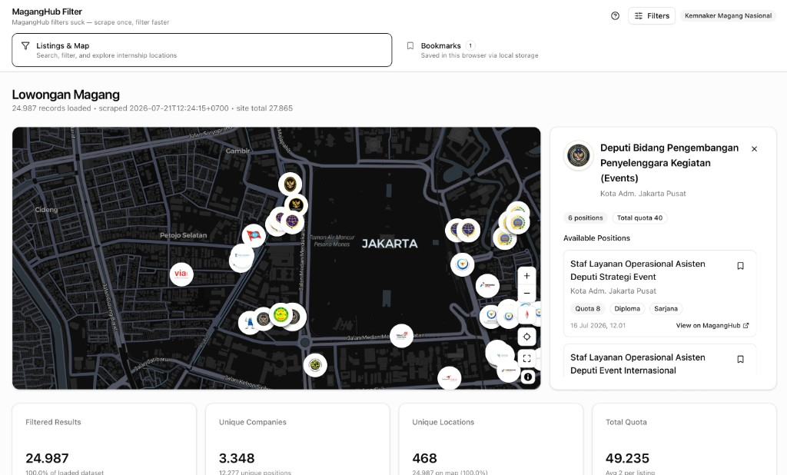

# MagangHub Filter



An **unofficial** browser dashboard for browsing public internship listings from [MagangHub Kemnaker](https://maganghub.kemnaker.go.id). It loads a pre-built snapshot of listing data and runs search, filters, stats, and map exploration entirely in your browser — no backend required.

> **Not affiliated with Kemnaker or MagangHub.** This project is a community tool for personal research and convenience. Always verify listing details and apply through the [official MagangHub site](https://maganghub.kemnaker.go.id).

**Bundled dataset:** 27,865 listings · scraped **2026-07-21 12:24 WIB** (`2026-07-21T12:24:15+0700`)

## Quick start

You only need Node.js. Python is **not** required to run the dashboard.

```bash
npm install
npm run dev
```

Open [http://localhost:5173](http://localhost:5173).

Production build:

```bash
npm run build
npm run preview
```

Static files land in `dist/` — deploy that folder to Netlify, Vercel, GitHub Pages, or any static host.

## What's included

- **27,865 internship listings** pre-loaded in `public/data/` (scraped 2026-07-21)
- **Instant client-side filtering** — search, multi-select filters, date/quota ranges, sorting, pagination
- **Map view** — company markers grouped by location, click to see open positions
- **Stats panel** — top companies, locations, education levels, and more
- **Bookmarks** — saved in your browser (`localStorage`), no account needed
- **Company logos** — cached locally under `public/logos/` for display only

## Project layout

```
magang-hub-filter/
├── docs/                # README assets (screenshot, etc.)
├── src/                 # React dashboard (Vite + TypeScript)
├── public/
│   ├── data/            # Static JSON (listings + filter metadata)
│   └── logos/           # Cached company logos
├── scrape/              # Optional Python tooling to refresh data
│   ├── scrape.py        # Scraper
│   ├── generate_static_data.py
│   ├── download_logos.py
│   ├── output/          # Raw scrape output
│   └── .venv/           # Python virtualenv (scrape only)
├── package.json
└── vite.config.ts
```

## Refreshing the data (optional)

If you want to update listings from MagangHub's public pages, use the Python tools in `scrape/`. Be respectful: use reasonable delays, do not bypass authentication or rate limits, and use the refreshed data for personal or non-commercial purposes unless you have permission.

```bash
cd scrape
python3 -m venv .venv
source .venv/bin/activate   # Windows: .venv\Scripts\activate
pip install -r requirements.txt

# 1. Scrape latest listings
python -m scrape.scrape

# 2. Download company logos (optional)
python -m scrape.download_logos

# 3. Regenerate static JSON for the frontend
python -m scrape.generate_static_data
```

Then restart `npm run dev` to pick up the new files in `public/data/`.

## Why static?

MagangHub's site re-filters on every interaction through their backend. With tens of thousands of records, that can feel slow.

This dashboard loads the dataset once, then runs all filtering, stats, and map aggregation in the browser. It is meant as a faster way to explore publicly available listings — not as a replacement for the official platform.

## Disclaimer

- **Unofficial tool** — not endorsed by, affiliated with, or operated by Kemnaker or MagangHub.
- **Data source** — listing information is derived from MagangHub's public pages and may be outdated, incomplete, or inaccurate. Check the official listing before applying.
- **Apply officially** — use the "View on MagangHub" link in each listing to apply on the official site.
- **Logos and trademarks** — company logos are cached for display convenience only. Logos and company names belong to their respective owners.
- **No warranty** — provided as-is, with no guarantee of accuracy, availability, or fitness for any purpose.
- **Your responsibility** — if you scrape, host, or redistribute this data, you are responsible for complying with applicable laws, website terms, and third-party rights.

## License

Use and modify freely. No warranty. No affiliation with Kemnaker or MagangHub.
